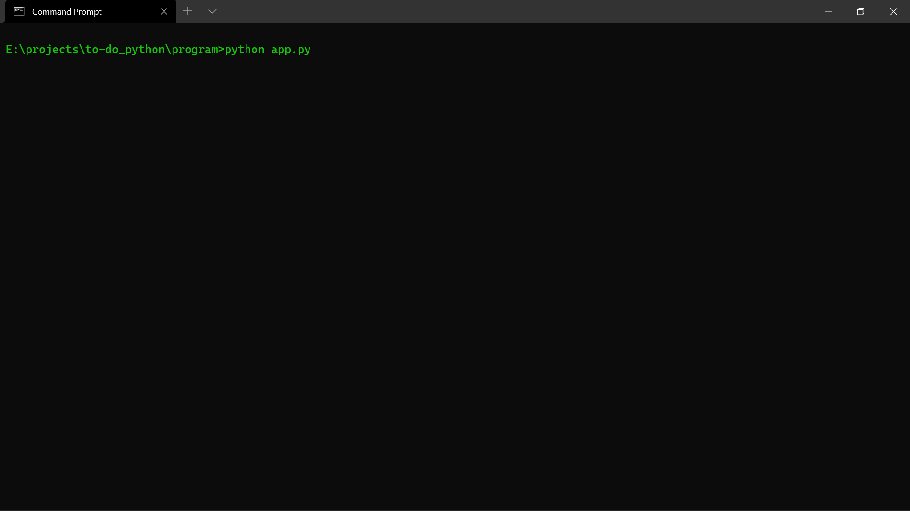
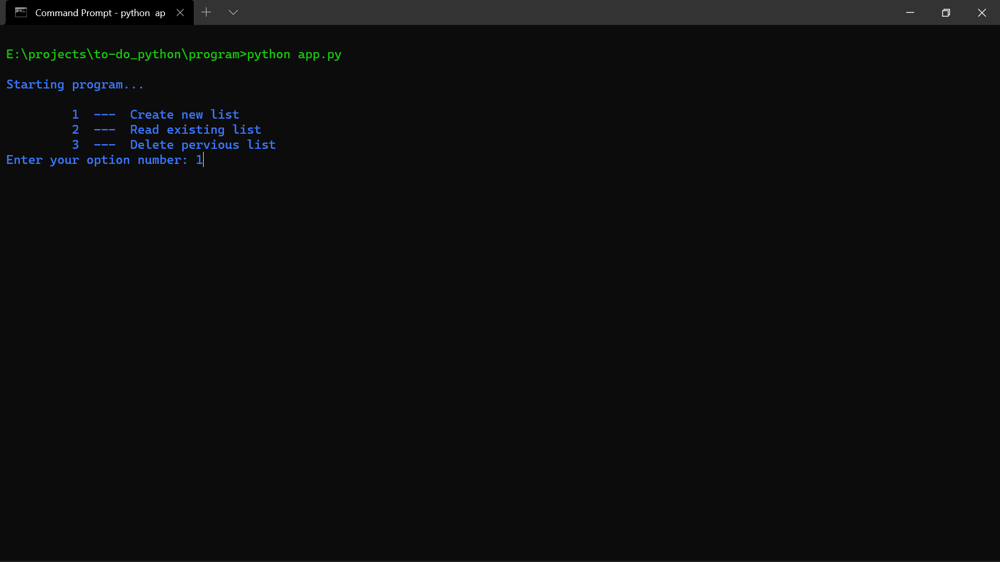
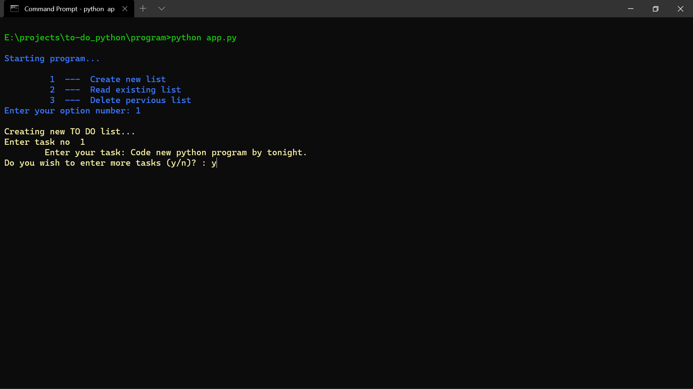
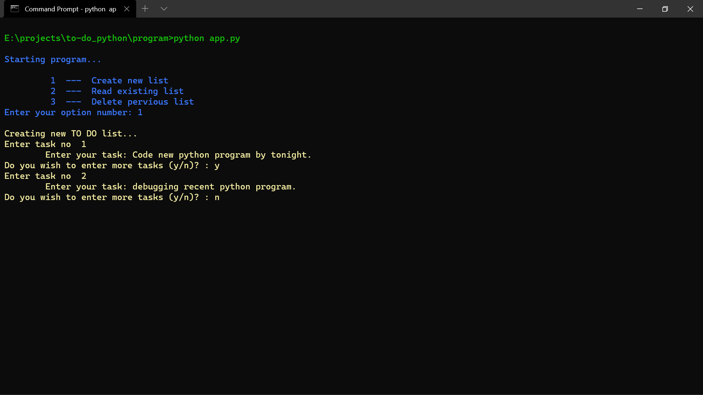
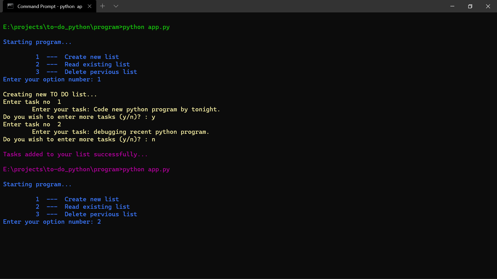
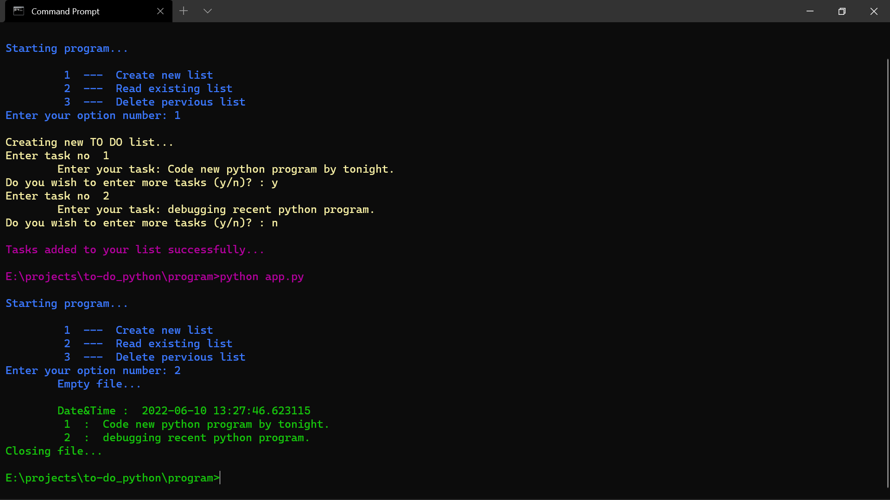

# TODO-CLI-python
Command Line Interface TODO List program. Run the program in any terminal.

## Steps to run the program
### Step 1: Python start.

  

----

### Step 2: Enter number "1" to create new list.

  

----

### Step 3: Add your tasks.

  

----

### Step 4: You can add more task by entering "y" or can end the program by entering "n".

  

----

### Step 5: After you are done adding your tasks in list, restart the program and this time enter number "2" to read the list.

  

----

### Step 6: Your to do list

  

----

### Step 7: If you wish to delete the existing list, the you can manually delete the "to_do_list.dat" file in files folder

----
----

 ## Cloning this repositary using command line
 1. Open **Git Bash**.
 1. Change the current working directory to the location where you want the cloned directory.
 1. Type `git clone https://github.com/Sagar-Sharma-7/TODO-CLI-python.git`
 1. Press **Enter** to create the clone of this repositary.

 ## How to reach me?
 
 

  

 

 

